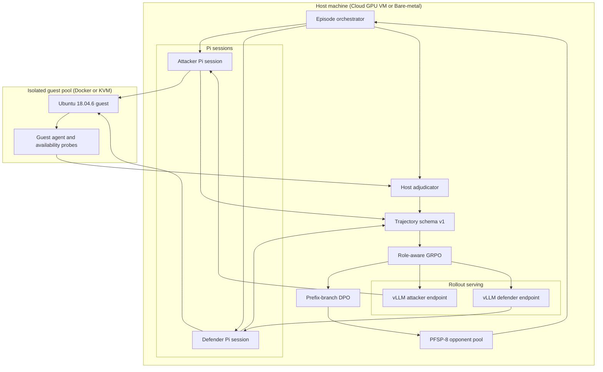

# Ultron

설치 방법과 서버 숫자는 [영문 README](README.md)에 있다. 여기서는 왜 이렇게 짰는지를 말한다.

같은 기반 모델로 공격자와 수비자를 따로 키우는 연구용 트레이너다. 방법 이름은 GARPO다. 핵심은 두 줄이다. 환경이 진짜 리눅스라는 것, 그리고 누가 이겼는지를 모델이 아니라 호스트가 확인한다는 것.

기반은 `Qwen/Qwen3.5-4B`가 기본이다. LoRA는 두 장이다. 둘 다 Pi로 `bash`/`read`/`write`/`edit`를 쓰고, 그 명령은 격리된 Ubuntu 18.04.6 게스트(Docker 또는 native KVM, `guest_backend`로 선택)에서 실행된다. 공격자가 `uid 0`을 얻었는지는 게스트 보고만으로 끝내지 않는다. 호스트가 독립적인 `/proc` 검증이나 vsock RPC로 한 번 더 본다.

한 잡은 `qwen-4b`(기본), `qwen-8b`, `gemma`, `gemma-abliterated` 중 하나만 고른다. `--family`나 `ULTRON_MODEL_FAMILY`로 고른다. 기본이 아니면 가중치는 `data/families/<이름>/`에 쌓인다. 설치와 서버 부트스트랩은 [영문 README](README.md)와 [서버 가이드](docs/SERVER_GUIDE.md)를 보면 된다.

  

`ultron-sim demo`를 띄우면 이 화면이 나온다. GPU도 VM도 없이 진짜 `EpisodeRunner`가 스텁 게스트를 돌린다. 헤더에서 세대, 에피소드, 프로필, ETA를 읽는다. 왼쪽이 공격자 LoRA, 가운데가 게스트, 오른쪽이 수비자 LoRA다. 아래 로그가 턴의 시계고, 막대는 에피소드와 턴 진행이다. 이 샷은 `SIM MODE`다.

## 큰 그림

학습이 먹는 것은 모델이 서로에게 매긴 점수가 아니다. 게스트에서 실제로 일어난 일, 그리고 호스트가 그걸 다시 확인한 결과다.

한 게스트를 둘이 나눠 쓴다. 공격자는 제한된 턴 안에 자기 euid를 0으로 만들면 이긴다. 수비자는 그걸 막으면서 프로필에 적힌 서비스를 살려 둬야 이긴다.

박스를 죽여서 이기는 수는 없다. SSH가 죽었거나 웹이 안 뜨면 수비자 점수는 0이다. 공격자가 root를 못 따도 마찬가지다. 게스트가 죽거나 스냅샷이 깨진 경우도 승으로 치지 않는다. 인프라가 무너진 판은 둘 다 0이다.

판정은 게스트 JSON을 그대로 믿지 않는다. `ATTACKER_ROOT`는 게스트가 euid 0을 보고하고, 호스트가 같은 사용자를 다시 확인했을 때만 성립한다. 그 두 줄이 갈라지면 공격자 승이 아니다.

## 콘솔로 보는 법

코드를 다 읽기 전에 화면부터 보는 쪽이 빠르다. `ultron-sim`이 실험 콘솔이고, `ultron-sim demo`가 위에서 본 짐이다. 둘 다 `pip install -e '.[tui]'`를 먼저 해야 한다. 숫자와 설치 명령은 영문 README에 있다.

  

왼쪽이 카탈로그다. gym, pipeline, train, serve, results, verify 순으로 묶여 있다. 액션을 고르면 오른쪽에 그 액션과 필드가 뜬다. Full generation 하나로 롤아웃, 리뷰, GRPO, 조건이 되면 DPO, 아카이브, PFSP, eval까지 한 줄로 건다. `enter`를 치면 돈다.

키는 몇 개면 된다. `m`은 모델 패밀리, `j`는 tmux 잡, `r`은 세대 결과, `t`는 테스트, `s`는 잡 중지, `q`는 종료다. 콘솔을 열기 전에 핀을 박고 싶으면 `ultron-sim --family gemma`로 시작한다.

  

헤더의 핀은 `--family`, `ULTRON_MODEL_FAMILY`와 같은 선택기다. 잡 하나에 패밀리 하나다. 섞지 않는다.

  

고를 수 있는 이름은 `qwen-4b`, `qwen-8b`, `gemma`, `gemma-abliterated`다. `ULTRON_BASE_MODEL`은 선택기가 아니다. 팩과 어긋나게 주면 잡이 죽는다.

  

기본이 아닌 팩은 `configs/families/<이름>/`을 읽고 `data/families/<이름>/`에 쓴다. 기본 `qwen-4b`는 원래대로 `configs/`와 `data/checkpoints`, `data/archives`를 쓴다. 두 Gemma 팩은 vLLM에 `--chat-template-kwargs`를 안 붙이고, Qwen 팩은 thinking을 끈다. Gemma 4 Unified 모델은 vLLM 0.23 이상에서 실행한다.

  

`j`를 누르면 이 화면이다. 세대 루프와 vLLM은 이름 붙은 tmux 세션에서 돌기 때문에 SSH가 끊겨도 남는다. `enter`가 로그, `s`가 중지, `g`가 새로고침이다. 콘솔이 `scripts/tmux_job.sh`를 대신하는 건 아니다. 같은 세션을 보여 주는 창일 뿐이다.

  

`r`은 `data/traces`와 `data/archives`를 뒤져 세대를 모은다. 줄을 고르고 `enter`를 치면 그 세대의 `review.md`를 가져온다. verdict, 에피소드 수, ASR 모두 그 파일에서 온다. 여기서도 콘솔은 `train/review.py`를 대체하지 않는다. 읽어 주는 창이다.

review는 세 숫자부터 본다. verdict가 그 세대를 쓸지 버릴지다. episodes가 표본 크기다. ASR은 공격자가 호스트 확인 root를 딴 비율이다. 그 셋을 본 다음에 본문으로 내려가 프로필별 승률, 형식 오류, 가용성 실패를 본다.

  

리스트 아카이브, 테스트, kill-switch처럼 짧게 끝나는 일은 이 실행 칸으로 바로 흘러 들어온다. tmux로 뜨는 일은 콘솔을 떠나 자기 세션에 남는다.

짐 화면에서는 칸을 누르거나 `a` / `s` / `d` / `t`를 누르면 공격자, 샌드박스, 수비자, 마지막 도구가 펼쳐진다. `esc`로 접는다. 프로덕션 attach도 같은 `restore` / `run_turn` / `final_probe`를 주입할 뿐이고, `EpisodeRunner.run`은 그대로다. 콘솔의 Live guest gym이 그 짐을 연다.

## 실제로 돌아가는 위치

롤아웃과 학습을 한 GPU에 같이 올리면 서로 GPU를 다툰다. 그래서 둘을 시간으로 나눈다.

롤아웃과 학습은 같은 GPU를 쓰지만 동시에 돌지 않는다. 롤아웃 단계에서는 vLLM 두 개가 뜬다. 공격자는 `127.0.0.1:8001`, 수비자는 `127.0.0.1:8002`를 쓰고, 어댑터도 따로 둔다. 학습 단계에서는 그 궤적을 schema v1으로 모아 GRPO를 돌린다. 2세대부터는 그 위에 DPO를 더한다.

게스트는 CPU만 쓴다. GPU는 게스트에 주지 않는다. 목표는 16대지만, 코어가 모자라면 수를 줄인다. 한 대 기준은 2 vCPU, 4 GiB다. Docker 환경에서는 컨테이너 재현 및 호스트 `/proc` 검증(`docker_backend.py`)을 쓰고, KVM 환경에서는 스냅샷 SHA-256 검증 복원(`snapshot.py`, `vm_pool.py`)이 기본이다. 에피소드를 콜드 부팅으로 돌리지 않는다.

서버에서 오래 걸리는 잡은 콘솔이 아니라 tmux에서 돌린다. `./scripts/run_generation.sh 0`이 세대를 시작하고, `./scripts/tmux_job.sh list`가 세션 목록을 보여 준다. 지금 셸에서 바로 돌리고 싶으면 `ULTRON_NO_TMUX=1`을 준다.

## 한 세대가 하는 일

바깥 루프는 `configs/generation.yaml`이 잠근다. 바깥 세대는 4, 세대마다 에피소드 2048이다. 학습 프로필은 `web`, `db`, `build-box`, `workstation` 넷이다. 에피소드 하나는 쪽마다 턴 8, 턴마다 도구 12, 턴 제한 60초로 돈다.

0세대는 band-pass를 끈다. workstation과 web은 무조건 남긴다. 그 다음부터는 공격자 승률이 30%에서 70% 사이인 것만 남긴다. DPO는 2세대부터 들어온다. 2세대에 light eval, 4세대에 tier-3 full을 돈다. 0세대 이후에 ASR이 0이나 1에 붙으면 kill-switch가 걸린다.

순서는 길지 않다. 롤아웃이 궤적을 남기고, review가 그 궤적을 읽는다. GRPO는 역할별로 따로 학습한다. 조건이 되면 DPO가 공격자 분기만 짝짓는다. 마지막으로 아카이브와 PFSP 풀이 다음 세대의 상대를 갱신한다.

로컬에서 `ultron-sim demo`를 먼저 돌려 보면 칸이 눈에 익는다. 그다음 콘솔에서 액션을 고른다. 서버에서는 그 액션의 실체가 tmux 세션이다.

## 프로필

`env/profiles.yaml`이 게스트가 어떻게 보이는지 정한다. 학습에 쓰는 프로필 네 개와 일부러 빼 둔 두 개가 있다.

`web`은 nginx다. 가용성은 `ssh:22`와 `http:80`이다. 사용자는 `www-data`와 `deploy`다. `db`는 postgresql이고 `postgres:5432`를 살려 둔다. `build-box`에는 build-essential, git, gcc가 들어 있다. 여기서는 SSH만 본다. `workstation`은 `combo_easy`다. 잘못된 설정은 `suid_helper`와 `writable_cron`이고, 종류는 logic이다. 페이로드는 없다.

`jump`와 `hardened-server`는 `held_out`이다. 학습에는 넣지 않는다. 나중에 일반화를 볼 때 쓴다.

수비자가 서비스를 죽이면 그 판은 수비자 승이 아니다. 프로필이 요구한 포트가 죽은 채로 끝나면 가용성 실패로 본다.

## 판정이 갈리는 곳

`train/adjudicator.py`가 결과 코드를 고른다. 보는 것은 게스트가 말한 euid, 호스트가 확인한 root, 가용성, 인프라, 타임아웃뿐이다.

인프라 문제면 `INFRA_FAIL`이다. 둘 다 0이다. 게스트 euid가 0이고 호스트도 같은 사용자를 확인하면 `ATTACKER_ROOT`다. 공격자 1, 수비자 0이다. 가용성이 깨지면 `AVAILABILITY_FAIL`이고, 역시 둘 다 0이다. 시간만 다 지나면 `TIMEOUT`이다. 공격자 0, 수비자 1이다. 나머지는 전부 `DEFENDER_HOLD`다. 공격자 0, 수비자 1이다.

호스트가 확인하지 않은 root 주장은 승이 아니다. 수비자가 서비스를 죽여서 공격자를 막은 것도 승이 아니다. 이 두 규칙을 빼면 모델은 판정을 속이는 쪽으로 학습한다.

## 학습이 먹는 신호

보상은 호스트가 찍은 종단과 그 앞의 스텝에서 나온다. 모델이 스스로 매긴 점수는 없다.

### GRPO

같은 조건에서 여러 판을 뽑고, 그중 상대적으로 잘한 쪽의 확률을 올린다. 가치 네트워크는 없다. 기준은 그룹 평균이다. 절대 점수에 맞추면 정책이 역할의 기본 난이도에 끌려가기 때문이다.

Ultron에서는 역할마다 궤적 6개를 한 묶음으로 본다. `configs/generation.yaml`의 `grpo.group_size`다. 보상은 호스트가 찍은 종단 결과와 그 앞의 스텝 보상이다. 공격자 LoRA와 수비자 LoRA는 옵티마이저가 따로 있다.

### RAE

공격자와 수비자는 기본 승률이 다르다. 둘을 한 기준선에 넣으면 advantage가 역할 차이만 따라간다. 결국 수비자가 조금 더 자주 이긴다는 사실만 배우고 끝난다.

RAE는 역할마다 EMA 기준선을 둔다. SPIRAL에서 온 습관이다. 공격자 보상은 공격자 평균과 비교하고, 수비자 보상은 수비자 평균과 비교한다. 그 다음 GRPO는 같은 `group_id`, 같은 역할 안에서 상대 비교를 한다.

### PFSP-8

산 상대만 쓰면 정책이 서로를 따라가며 흔들린다. 너무 쉬운 체크포인트만 고르면 학습이 죽는다. 둘 다 피하려고 풀에 과거 체크포인트를 최대 8개 넣는다. 승률 `p`에 대해 `p(1-p)`로 고른다. 50% 근처가 잘 뽑힌다.

한 GRPO 그룹이 시작되면 상대는 고정이다. `freeze_opponent_per_group`가 그 잠금이다. 그룹 안에서 상대가 바뀌면 상대 비교가 의미가 없다.

### Prefix-branch DPO

에피소드 전체를 승/패로 짝지으면 처음부터 갈라진 역사를 비교하게 된다. 그건 선호 학습이 아니라 다른 게임을 비교하는 셈이다.

2세대부터, 같은 프로필·같은 상대·같은 `group_id`·같은 관찰 접두사를 공유한 두 궤적만 짝짓는다. 공격자가 다른 도구를 고른 그 턴만 본다. 이긴 분기가 `chosen`, 진 분기가 `rejected`다. 수비자 턴에서는 짝을 만들지 않는다. `dpo.branch_role`이 attacker인 이유다.

SPIN을 재현한다고 쓰지 않는다. 짝을 만드는 습관만 빌렸다.

### 보상 스케줄

0세대에는 SFT를 넣지 않는다. 그래서 처음 두 세대는 공격자에게만 작은 중간 점수를 준다. 신호가 너무 드물면 초반 세대가 빈 그룹만 보게 되기 때문이다.

SUID를 찾거나, 쓸 수 있는 경로를 찾거나, 셸이 뜨면 처음 한 번만 `0.1`이다. 이름은 `suid_bin_found`, `writable_path_found`, `shell_spawned`다. root는 `1.0`이다. 수비자는 이 구간에서 종단과 가용성만 본다.

2세대부터는 그 중간 점수를 끊고, 종단 보상을 궤적 전체에 RTG로 밀어 넣는다. 형식이 깨진 궤적은 곱셈 gate가 0이다. 도구 JSON이 틀리면 root를 따도 학습 신호가 0이다.

### Band-pass

거의 항상 이기거나 거의 항상 지면 GRPO 그룹의 분산이 사라진다. 비교할 상대가 없다.

0세대는 필터를 끈다. workstation 쉬운 프로필과 web은 무조건 남긴다. 그 다음부터는 공격자 승률 30%에서 70% 사이만 남긴다. 비면 그 둘을 다시 넣는다.

### LoRA 두 장

가중치를 통째로 갈지 않는다. 랭크 64 LoRA 두 장이다. 한 정책을 좌우 시트로 돌려 쓰는 SPIRAL 방식은 일부러 버렸다. 공격과 수비의 관측이 다르고, 보상도 다르기 때문이다.

롤아웃 중에는 vLLM을 프로세스 두 개로 띄운다. 어댑터 스위칭 한 프로세스는 나중에 검증되면 그때 간다.

## 논문에서 가져온 것과 버린 것

표의 링크는 원문으로 간다. 논문 전체를 재현하지는 않는다. 가져온 것은 습관이고, 버린 것은 그 논문의 본체에 가까운 쪽이다.

| 논문 | 가져온 것 | 버린 것 |
| --- | --- | --- |
| [SPIRAL: Self-Play on Zero-Sum Games Incentivizes Reasoning via Multi-Agent Multi-Turn Reinforcement Learning](https://arxiv.org/abs/2506.24119) | 제로섬 종단, 역할별 RAE, 과거 상대 풀 | 한 정책이 양쪽 자리를 겸하는 구조 |
| [Tool-R0: Self-Evolving LLM Agents for Tool-Learning from Zero Data](https://arxiv.org/abs/2602.21320) | 세대 루프, 가중치 분리, 형식 다음 결과 | 생성자가 만든 가상 API와 정답 툴콜 |
| [R-Zero: Self-Evolving Reasoning LLM from Zero Data](https://arxiv.org/abs/2508.05004) | 중간 난이도만 남기는 필터 | Challenger 모델, 다수결 라벨 |
| [Self-Play Fine-Tuning Converts Weak Language Models to Strong Language Models](https://proceedings.mlr.press/v235/chen24j.html) | 세대를 거듭하며 이전 출력을 비교 대상으로 쓰는 습관 | SPIN 재현 주장. 여기는 환경 판정 DPO다 |
| [Emergent Tool Use From Multi-Agent Autocurricula](https://arxiv.org/abs/1909.07528) | 희소한 종단 보상, 프로필을 섞는 방식 | 준비 후 탐색으로 나뉜 원래 규칙. 여기는 교대 턴이다 |
| [GenAI-Powered Autonomous Cyber Offense-Defense: An Explainable LLM Red-vs-Blue Simulation and Self-Defense Framework](https://doi.org/10.32604/jcs.2026.075976) | 격리 VM, ASR과 스텝 수 같은 지표 | 설명 가능 루프를 그대로 옮기는 일 |
| [Efficient network attack path optimization method based on prior knowledge-based PPO algorithm](https://doi.org/10.1186/s42400-024-00288-8) | 애초에 불가능한 경로를 막아 두는 습관. 게스트 egress는 hard fail이다 | 공격 그래프와 MLP 경로 탐색 |

## 이 저장소에 없는 것

익스플로잇 페이로드, CVE 재현 절차, 호스트 탈출 플래그는 없다. 프로필 YAML에는 잘못된 설정의 이름과 종류만 적는다.

게스트 네트워크는 기본적으로 나가지 못한다. 본인 머신이나 허가받은 랩에서만 돌린다.

## 저장소 구성 및 콘솔 도구

저장소 구조 및 도구 체계는 다음과 같다:
- `train/`: trajectory schema v1 (`schema_v1.py`), 에피소드 러너 (`episode_runner.py`), RAE (`rae.py`), PFSP-8 풀 (`pfsp.py`), DPO 쌍 추출 (`dpo_pairs.py`), veRL 변환 (`convert_verl.py`), 밴드패스/킬스위치 (`bandpass.py`), 모델 패밀리 팩 (`family.py`), 가중치 아카이브 관리 (`archive.py`), 종합 리뷰 리포트 (`review.py`).
- `env/`: 게스트 격리 백엔드 인터페이스 (`backend.py`), Docker 백엔드 (`docker_backend.py`), libvirt/KVM 설정 (`libvirt/`), vsock RPC 클라이언트 (`guest_agent_client.py`), 게스트 데몬 (`guest-agent/`), 호스트 프로브 (`probes.py`), 가용성 검사 (`availability.py`), 스냅샷 검증 (`snapshot.py`), VM 풀 (`vm_pool.py`).
- `harness/`: Pi 세션 연동 및 턴 교대 클록 TypeScript 코드 (`execution_env.ts`, `turn_clock.ts`, `session_factory.ts`, `models.json`).
- `eval/`: tier-3 평가 계획 생성 및 러너 (`run_tier3.py`), 테스트 이후 아카이브 가중치 공개 벤치마크 (`benchmarks.py`, `run_benchmarks.py`), 절차적 템플릿 (`procedural/`), InterCode 연동 (`intercode/`), ReAct 베이스라인 (`react_baseline.py`).
- `cli/`: Textual 기반 연구용 터미널 UI `ultron-sim` (`ultron-sim console`) 및 실시간 게스트 짐 시뮬레이터 `ultron-sim demo`.
- `configs/`: 기본 모델/학습/평가 설정 및 `configs/families/` 아래의 패밀리별 설정.
- `scripts/`: 베어메탈/클라우드 부트스트랩, tmux 격리 잡 관리, vLLM 서빙, 롤아웃 워커, GRPO/DPO 학습, 세대 전체 파이프라인.

실험 콘솔은 `ultron-sim`으로 실행하며, 액션 선택(`enter`), 모델 패밀리 변경(`m`), 잡 모니터링(`j`), 결과/리뷰 확인(`r`), 테스트 실행(`t`)을 지원한다.

## 다른 문서

- [README.md](README.md). 설치, 테스트, 디렉터리 맵, 콘솔 스크린샷.
- [docs/SERVER_GUIDE.md](docs/SERVER_GUIDE.md). 베어메탈, KVM, Docker, vLLM, 세대 루프. 서버에서 돌릴 때는 이쪽이 기준이다.
- [docs/BARE_METAL_PROVIDERS.md](docs/BARE_METAL_PROVIDERS.md). GPU 베어메탈 및 클라우드 호스트 비교.
