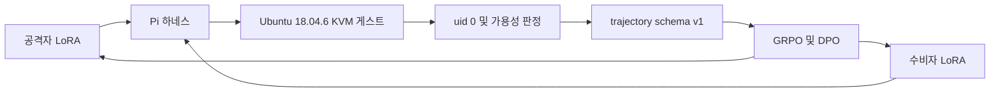
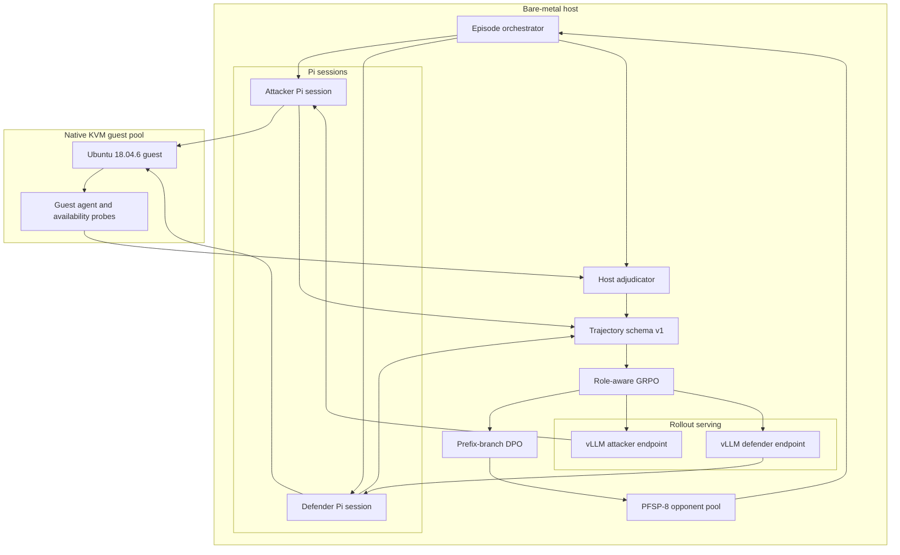

# Ultron

같은 기반 모델로 공격자와 수비자를 따로 키우는 연구용 트레이너다. 이름은 GARPO다. 환경이 진짜 리눅스라는 점과, 누가 이겼는지를 모델이 아니라 호스트가 확인한다는 점이 핵심이다.

기반은 `Qwen/Qwen3.5-4B`다. LoRA는 두 장이다. 둘 다 Pi로 `bash`/`read`/`write`/`edit`를 쓰고, 그 명령은 native KVM 위의 Ubuntu 18.04.6 게스트에서 실행된다. 공격자가 `uid 0`을 얻었는지는 게스트 보고만으로 끝내지 않는다. 호스트가 한 번 더 본다.

설치와 서버 부트스트랩은 [영문 README](README.md)와 [서버 가이드](docs/SERVER_GUIDE.md)를 보면 된다. 이 문서는 구조와 학습 쪽만 적는다.

## 큰 그림

한 게스트를 둘이 나눠 쓴다. 공격자는 제한된 턴 안에 자기 euid를 0으로 만들면 이긴다. 수비자는 그걸 막으면서 프로필에 적힌 서비스를 살려 둬야 이긴다.

박스를 죽여서 이기는 수는 없다. SSH가 죽었거나 웹이 안 뜨면 수비자 점수는 0이다. 공격자가 root를 못 따도 마찬가지다. 게스트가 죽거나 스냅샷이 깨진 경우도 승으로 치지 않는다.

판정은 게스트 JSON을 그대로 믿지 않는다. `ATTACKER_ROOT`는 게스트가 euid 0을 보고하고, 호스트가 같은 사용자를 다시 확인했을 때만 성립한다.

## 실제로 돌아가는 위치

롤아웃과 학습은 같은 GPU에서 겹치지 않는다. 롤아웃 때는 vLLM 두 개다. 포트가 갈라져 있고, 어댑터도 갈라져 있다. 학습 때는 그 궤적을 schema v1으로 모아 GRPO를 돌리고, 2세대부터 DPO를 얹는다.

게스트는 CPU만 쓴다. 16대를 목표로 두되, 코어가 모자라면 줄인다. 스냅샷 복원이 기본이다. 콜드 부팅으로 에피소드를 돌리지 않는다.

## 학습이 먹는 신호

### GRPO

같은 조건에서 여러 판을 뽑고, 그 안에서 상대적으로 잘한 쪽의 확률을 올린다. 가치 네트워크는 없다. 그룹 평균이 기준이다.

Ultron에서는 역할마다 궤적 6개를 한 묶음으로 본다. 보상은 호스트가 찍은 종단 결과와 그 앞의 스텝 보상이다. 공격자 LoRA와 수비자 LoRA는 옵티마이저가 따로 있다.

### RAE

공격자와 수비자의 기본 승률이 다르다. 그걸 한 기준선에 넣으면 advantage가 역할 차이만 따라간다. RAE는 역할마다 EMA 기준선을 둔다. SPIRAL에서 온 습관이다.

공격자 보상은 공격자 평균과 비교하고, 수비자 보상은 수비자 평균과 비교한다. 그 다음 GRPO는 같은 `group_id`, 같은 역할 안에서 상대 비교를 한다.

### PFSP-8

산 상대만 쓰면 정책이 서로를 따라가며 흔들린다. 너무 쉬운 체크포인트만 고르면 학습이 죽는다. 풀에 과거 체크포인트를 최대 8개 넣고, 승률 `p`에 대해 `p(1-p)`로 고른다. 50% 근처가 잘 뽑힌다.

한 GRPO 그룹이 시작되면 상대는 고정이다. 그룹 안에서 상대가 바뀌면 상대 비교가 의미가 없다.

### Prefix-branch DPO

에피소드 전체를 승/패로 짝지으면 처음부터 갈라진 역사를 비교하게 된다. 그건 선호 학습이 아니라 다른 게임을 비교하는 셈이다.

2세대부터, 같은 프로필·같은 상대·같은 `group_id`·같은 관찰 접두사를 공유한 두 궤적만 짝짓는다. 공격자가 다른 도구를 고른 그 턴만 본다. 이긴 분기가 `chosen`, 진 분기가 `rejected`다. 수비자 턴에서는 짝을 만들지 않는다.

SPIN을 재현한다고 쓰지 않는다. 짝을 만드는 습관만 빌았습니다.

### 보상 스케줄

0세대에 SFT를 넣지 않기로 했다. 그래서 처음 두 세대는 공격자에게만 작은 중간 점수를 준다. SUID를 찾거나, 쓸 수 있는 경로를 찾거나, 셸이 뜨면 처음 한 번만 `0.1`이다. root는 `1.0`이다. 수비자는 이 구간에서 종단과 가용성만 본다.

2세대부터는 그 중간 점수를 끊고, 종단 보상을 궤적 전체에 RTG로 밀어 넣는다. 형식이 깨진 궤적은 곱셈 gate가 0이다. 도구 JSON이 틀리면 root를 따도 학습 신호가 0이다.

### Band-pass

거의 항상 이기거나 거의 항상 지면 GRPO 그룹 분산이 사라진다. 0세대는 필터를 끈다. workstation 쉬운 프로필과 다른 하나 정도는 무조건 남긴다. 그 다음부터는 공격자 승률 30%에서 70% 사이만 남긴다. 비면 그 둘을 다시 넣는다.

### LoRA 두 장

가중치를 통째로 갈지 않는다. 랭크 64 LoRA 두 장이다. 한 정책을 좌우 시트로 돌려 쓰는 SPIRAL 방식은 일부러 버렸다. 공격과 수비의 관측이 다르고, 보상도 다르기 때문이다.

롤아웃 중에는 vLLM을 프로세스 두 개로 띄운다. 어댑터 스위칭 한 프로세스는 나중에 검증되면 그때 간다.

## 논문에서 가져온 것과 버린 것

표의 링크는 원문이다. 논문 전체를 재현하지 않는다.

| 논문 | 가져온 것 | 버린 것 |
| --- | --- | --- |
| [SPIRAL: Self-Play on Zero-Sum Games Incentivizes Reasoning via Multi-Agent Multi-Turn Reinforcement Learning](https://arxiv.org/abs/2506.24119) | 제로섬 종단, 역할별 RAE, 과거 상대 풀 | 한 정책이 양쪽 자리를 겸하는 구조 |
| [Tool-R0: Self-Evolving LLM Agents for Tool-Learning from Zero Data](https://arxiv.org/abs/2602.21320) | 세대 루프, 가중치 분리, 형식 다음 결과 | 생성자가 만든 가상 API와 정답 툴콜 |
| [R-Zero: Self-Evolving Reasoning LLM from Zero Data](https://arxiv.org/abs/2508.05004) | 중간 난이도만 남기는 필터 | Challenger 모델, 다수결 라벨 |
| [Self-Play Fine-Tuning Converts Weak Language Models to Strong Language Models](https://proceedings.mlr.press/v235/chen24j.html) | 세대를 거듭하며 이전 출력을 비교 대상으로 쓰는 습관 | SPIN 재현 주장. 여기는 환경 판정 DPO다 |
| [Emergent Tool Use From Multi-Agent Autocurricula](https://arxiv.org/abs/1909.07528) | 희소한 종단 보상, 프로필을 섞는 방식 | 준비 후 탐색으로 나뉜 원래 규칙. 여기는 교대 턴이다 |
| [GenAI-Powered Autonomous Cyber Offense-Defense: An Explainable LLM Red-vs-Blue Simulation and Self-Defense Framework](https://doi.org/10.32604/jcs.2026.075976) | 격리 VM, ASR과 스텝 수 같은 지표 | 설명 가능 루프를 그대로 옮기는 일 |
| [Efficient network attack path optimization method based on prior knowledge-based PPO algorithm](https://doi.org/10.1186/s42400-024-00288-8) | 애초에 불가능한 경로를 막아 두는 습관. 게스트 egress는 hard fail이다 | 공격 그래프와 MLP 경로 탐색 |

## 이 저장소에 없는 것

익스플로잇 페이로드, CVE 재현 절차, 호스트 탈출 플래그는 없다. 프로필 YAML에는 잘못된 설정의 이름과 종류만 적는다.

게스트 네트워크는 기본적으로 나가지 못한다. 본인 머신이나 허가받은 랩에서만 돌린다.

## 다른 문서

- [README.md](README.md). 설치, 테스트, 디렉터리 맵.
- [docs/SERVER_GUIDE.md](docs/SERVER_GUIDE.md). 베어메탈, KVM, vLLM, 세대 루프. 서버에서 돌릴 때는 이쪽이 기준이다.
