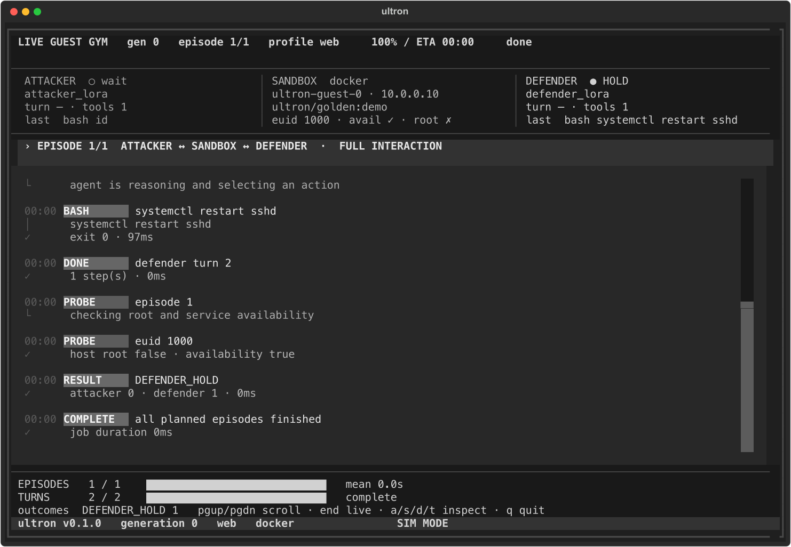
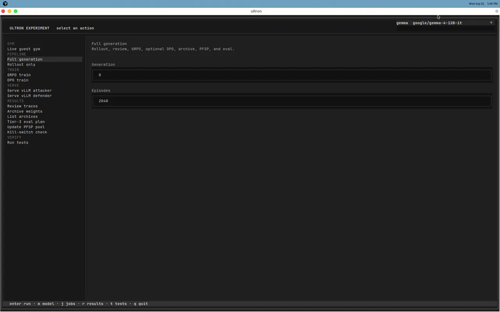
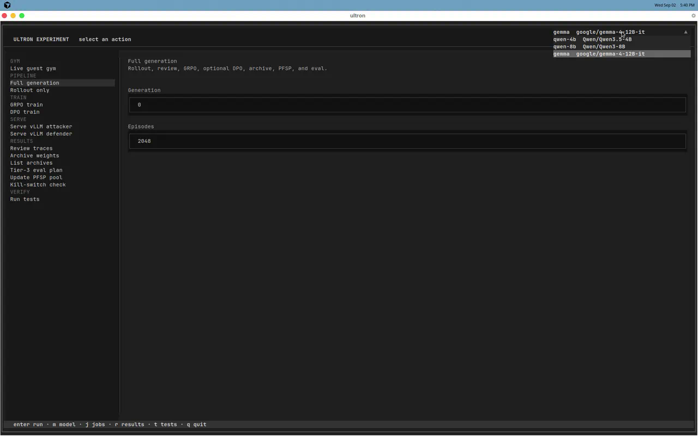
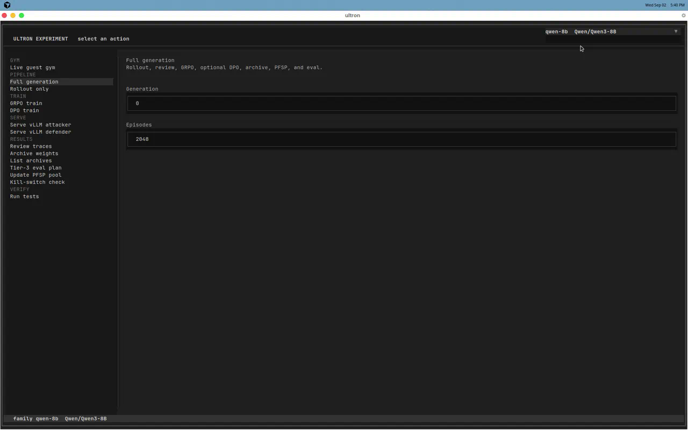
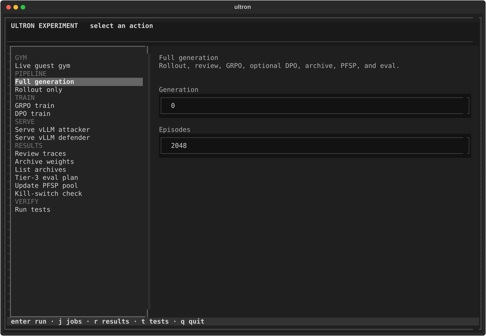
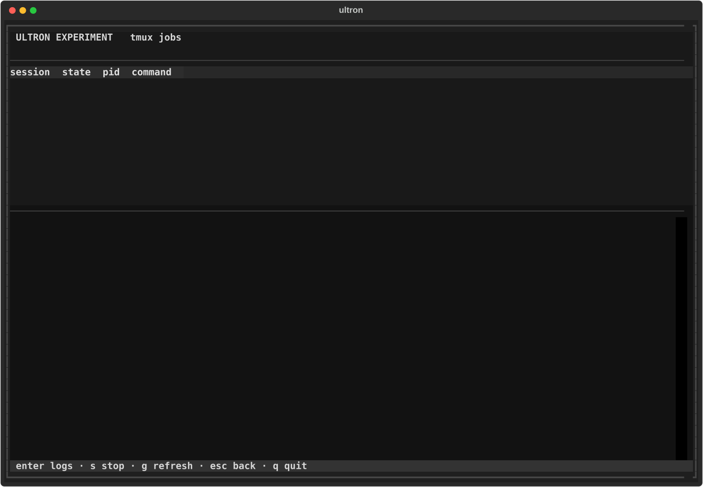
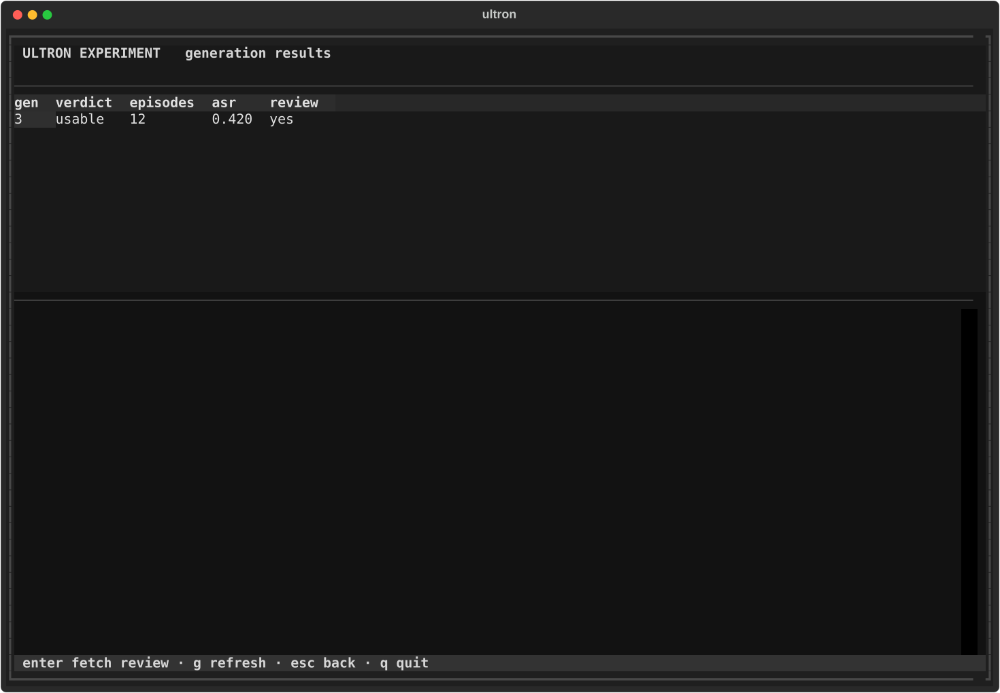
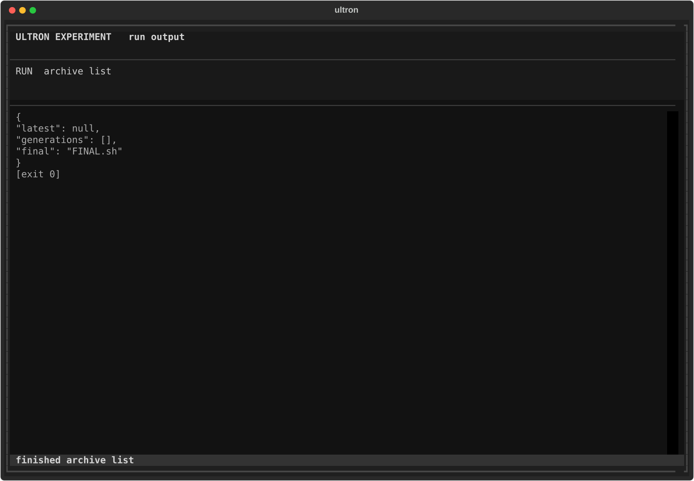

# Ultron

[Korean version](README.ko.md)

Ultron is a research trainer for environment-grounded asymmetric self-play. Separate attacker and defender LoRAs act through Pi in isolated Ubuntu 18.04 guests. Guests are Docker or KVM, selected by `guest_backend`. GRPO, DPO, and vLLM run on cloud GPU VMs. A guest probe plus an independent host-side check adjudicates uid 0. Availability probes prevent the defender from scoring by breaking required services.

<p align="center">
  
</p>

`ultron-sim demo` is the live guest gym. The header keeps generation, episode, profile, and ETA in view. The three panes are the attacker LoRA, the guest, and the defender LoRA. Watch the log if you want the turn clock. The bars track episode and turn progress. This shot is SIM MODE: a real `EpisodeRunner` running against stub guests, so you can learn the layout with no GPUs and no VMs.

This repository is research-ready scaffolding. Pure Python contracts, reward logic, PFSP sampling, DPO pair extraction, configuration, launch scripts, and tests run without GPUs or guests. vLLM serving and GRPO or DPO training run on any NVIDIA host. Isolated rollouts need Docker (`scripts/bootstrap_cloud.sh`) or native KVM. See [docs/SERVER_GUIDE.md](docs/SERVER_GUIDE.md).

## Server requirements

Python unit tests, reward logic, and `ultron-sim demo` need no GPU. Isolated rollouts, vLLM, GRPO, and DPO do.

Supported bases are Qwen 4B, Qwen 8B, and Gemma 12B. The checked-in default is `Qwen/Qwen3.5-4B`. Point `configs/model.yaml`, `ULTRON_BASE_MODEL`, `configs/train_grpo.yaml`, and `configs/train_dpo.yaml` at `Qwen/Qwen3-8B` or `google/gemma-3-12b-it` only on a host that meets that row. Qwen 27B, 35B, and larger Qwen MoE checkpoints are not supported.

Figures assume two vLLM processes (attacker and defender), BF16 weights, `max_model_len` 32768, LoRA rank 64, 16 CPU-only guests at 2 vCPU / 4 GiB each, and GRPO or DPO after both servers stop. Guests never take a GPU. Pin one GPU per role. Do not overlap vLLM and FSDP.

| Variant | CPU | Host RAM | Recommended GPU setup |
| --- | --- | --- | --- |
| `Qwen/Qwen3.5-4B` (locked) | 32 physical cores; 64 safer | 128 GB | 2× A100 80 GB, or 2× H100 80 GB. Attacker on GPU 0, defender on GPU 1 (`ULTRON_ATTACKER_GPU` / `ULTRON_DEFENDER_GPU`). |
| `Qwen/Qwen3-8B` | 32 physical cores; 64 safer | 192 GB | 2× H100 80 GB or 2× A100 80 GB with the same one-GPU-per-role pin. 2× L40S 48 GB only if you cut guest concurrency. |
| `google/gemma-3-12b-it` | 32 physical cores; 64 safer | 192 GB | 2× H100 80 GB preferred; 2× A100 80 GB is the fallback. Skip 24 GB cards. 48 GB cards need a smaller guest pool. |

Every row also needs x86-64, Ubuntu 22.04 or 24.04, an NVIDIA datacenter driver, and at least 1 TB local NVMe for the base image, overlays, Hugging Face cache, traces, and checkpoints. Docker guests use `scripts/bootstrap_cloud.sh` and do not need `/dev/kvm`. Native KVM guests need `/dev/kvm` and the 32-core floor if you keep 16 VMs.

## Quick start

Use Python 3.10 or newer.

```bash
python3 -m venv .venv
source .venv/bin/activate
python -m pip install -e '.[dev]'
python -m pytest train/tests/ -q
```

Or with [uv](https://docs.astral.sh/uv/) and the committed lockfile:

```bash
uv sync --extra dev
uv run pytest train/tests/ -q
```

The gym and the experiment console need the TUI extra:

```bash
python -m pip install -e '.[tui]'
ultron-sim demo
ultron-sim
```

Initialize upstream code when you are on the training server:

```bash
git submodule update --init --recursive
npm install
npm run check
```

Do not place guest images, traces, model weights, credentials, or checkpoints in Git. The ignore rules cover the standard paths.

## Repository map

- `train/` owns trajectory schema v1, adjudication, rewards, RAE, PFSP, DPO pairing, conversion, curriculum, post-run job review, and orchestration interfaces.
- `env/` owns guest RPC, host probes, availability, snapshots, the VM pool, cloud-init profiles, and libvirt templates.
- `harness/` defines the Pi-facing TypeScript execution and turn interfaces.
- `eval/` defines tier-3 plans, procedural selection, InterCode integration points, and the ReAct baseline interface.
- `configs/` records the locked model, host, generation, training, and evaluation parameters.
- `scripts/` contains host checks, vLLM launchers, rollout launch, and generation training entry points.
- `cli/` is the experiment console (`ultron-sim`) and live guest-gym dashboard (`ultron-sim demo`). The console launches generation, training, review, tests, and tmux jobs. It does not replace `train/review.py`.

## Long-running jobs

Generation, rollout, GRPO, DPO, and vLLM launchers start in named tmux sessions so they keep running after SSH disconnects, hangup, or a closed terminal. Nested calls from `run_generation.sh` stay in the parent session.

```bash
./scripts/run_generation.sh 0
./scripts/serve_vllm_attacker.sh
./scripts/tmux_job.sh list
./scripts/tmux_job.sh attach ultron-gen-0
./scripts/tmux_job.sh logs ultron-gen-0
./scripts/tmux_job.sh stop ultron-vllm-attacker
```

Set `ULTRON_NO_TMUX=1` to run in the current shell. See [docs/SERVER_GUIDE.md](docs/SERVER_GUIDE.md).

## Model families

A job pins one base-model family. Unset family is `qwen-4b` (`Qwen/Qwen3.5-4B`) and keeps the original `configs/` files plus `data/checkpoints` and `data/archives`. `qwen-8b` is `Qwen/Qwen3-8B`. `gemma` is `google/gemma-4-12B-it`. Those two live under `configs/families/<name>/` and write under `data/families/<name>/`.

<p align="center">
  
</p>

The pin in the header is the same selector you set with `--family` or `ULTRON_MODEL_FAMILY`. Here it reads `gemma`.

<p align="center">
  
</p>

Press `m` to jump to the selector. You get three names and only three: `qwen-4b`, `qwen-8b`, and `gemma`.

<p align="center">
  
</p>

Pick `qwen-8b` and everything writes under `data/families/qwen-8b/`. The default `qwen-4b` pack stays where it is, on `data/checkpoints` and `data/archives`.

```bash
./scripts/run_generation.sh 0
./scripts/run_generation.sh --family qwen-8b 0
ULTRON_MODEL_FAMILY=gemma ./scripts/serve_vllm_attacker.sh
```

`--family` and `ULTRON_MODEL_FAMILY` are the selector. `ULTRON_BASE_MODEL` is not. If that variable is set and disagrees with the pack, the job exits. Gemma omits vLLM `--chat-template-kwargs`. Qwen packs pass thinking off.

## Experiment console

`ultron-sim` opens a full-screen TUI for the research loop: pick a generation, launch rollout or training, watch tmux jobs, run unit tests, and fetch `review.md` results.

```bash
python -m pip install -e '.[tui]'
ultron-sim
```

<p align="center">
  
</p>

The list on the left is the catalog, grouped into gym, pipeline, train, serve, results, and verify. Pick an action and the right pane shows it with its fields. Full generation chains the whole loop: rollout, review, GRPO, an optional DPO step, archive, PFSP, and eval.

Keys: `enter` runs the selected action, `m` focuses the model-family selector, `j` lists jobs, `r` lists generation results, `t` jumps to tests, `s` stops a job, `q` quits. `ultron-sim --family gemma` sets the same pin before the console opens.

<p align="center">
  
</p>

`j` opens the tmux job table. From there, `enter` opens logs, `s` stops the session you have selected, and `g` refreshes the list. Long jobs still live in the named sessions that `scripts/tmux_job.sh` starts, not in the console.

<p align="center">
  
</p>

`r` lists the generations it finds under `data/traces` and `data/archives`. Hit `enter` on a row and the console pulls in that generation's `review.md`. Verdict, episode count, and ASR all come straight from that file. This is a reader, not a replacement for `train/review.py`.

<p align="center">
  
</p>

Foreground actions like list archives, tests, and the kill-switch check stream right into this run view. Anything launched through tmux leaves the console and keeps running in its own session.

`ultron-sim demo` is the live guest-gym view. It shows attacker and defender turns, the sandbox identity, a scrolling process log, progress, and an ETA. Click a pane, or press `a` / `s` / `d` / `t`, to expand its detail. The demo drives a real `EpisodeRunner` with stub guests, so you can check the layout without GPUs or VMs. Production attach wraps the same injected `restore` / `run_turn` / `final_probe` callables and leaves `EpisodeRunner.run` untouched. From the console, the "Live guest gym" action opens the same view.

## Safety boundary

Ultron targets disposable guests on a default-deny isolated libvirt network. The repository contains misconfiguration identifiers, not exploit payloads, CVE procedures, or host escape material. Run only on systems you own or have explicit permission to test.

## Current implementation boundary

The Python unit tests do not require hardware. The Pi-to-KVM bridge and veRL launch commands are explicit integration points. `rollout_worker.sh` requires `ULTRON_ROLLOUT_COMMAND`; `train_dpo.sh` requires `ULTRON_DPO_COMMAND`. Set them only after the corresponding milestone gate passes.
